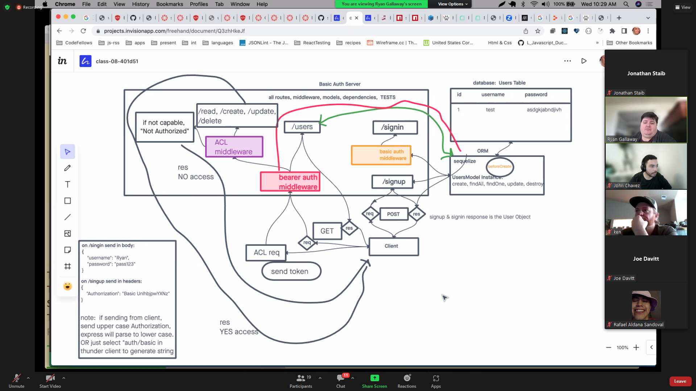

# LAB - Class 07

## Project: Bearer Auth

### Author: Jonathan Staib

### Problem Domain

integrate auth-server and api-server into one server with proper auth and crud functionality as well as utilize acl for role assignment and access.

### Links and Resources

- Ryan Gallaway
- starter code

### Setup

#### `.env` requirements (where applicable)

PORT
DATABASE_URL
SECRET

#### How to initialize/run your application (where applicable)

`nodemon`

#### How to use your library (where applicable)

CRUD function available for my pg database

#### Features / Routes

all working CRUD functionality with /get, /post, /put, /delete if you have proper authorization based on token and check whether you have proper role assignment. You will need to authenticate yourself with your signup(post) and login for basic auth.

#### Tests

tests for all middleware(auth) and tests for all crud functionality on v1 and v2 routes

#### UML

